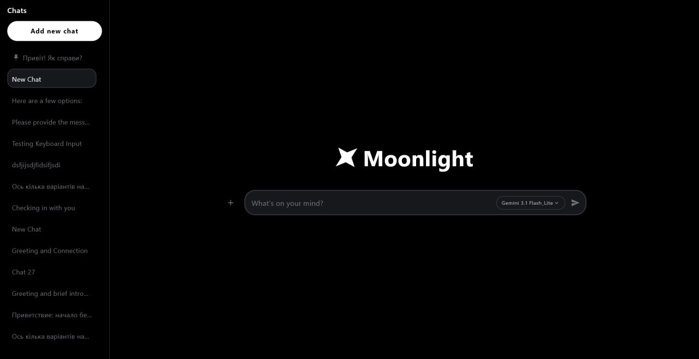
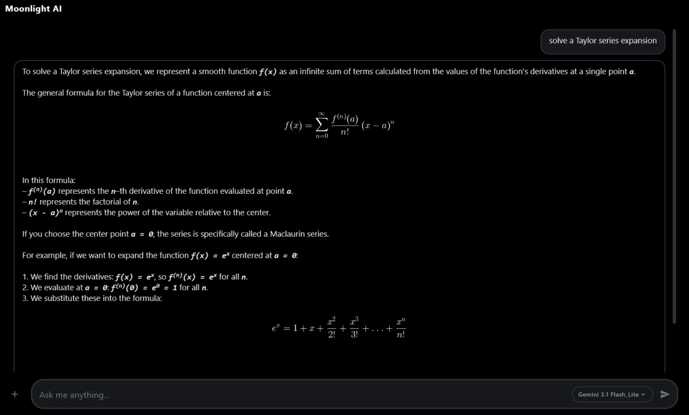
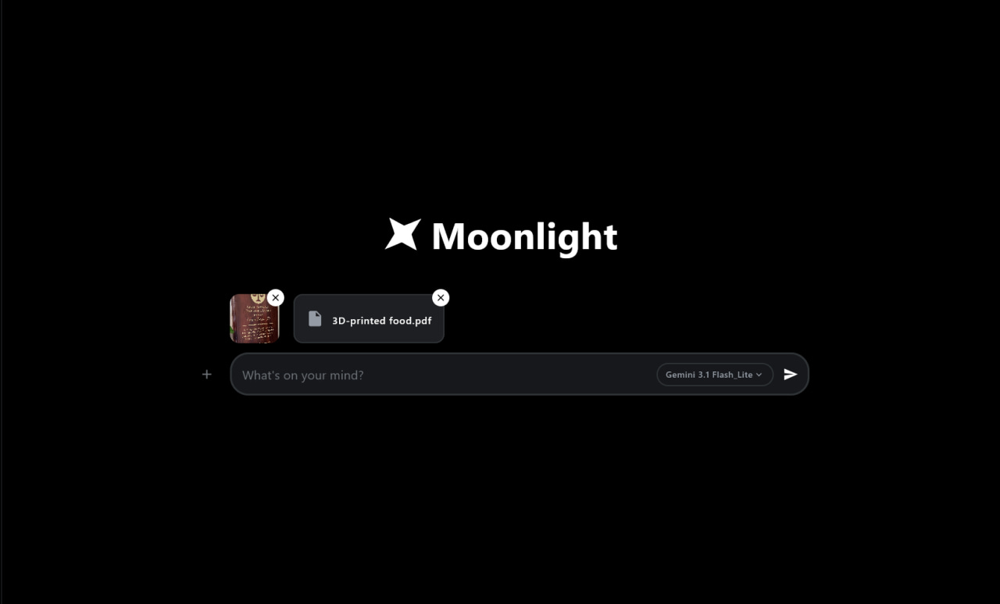

# Moonlight AI ✨

A modern, lightning-fast, and highly customizable desktop application for interacting with artificial intelligence using the **Gemini API** and **OpenRouter**. The interface is built entirely with **Jetpack Compose Desktop**, adhering to modern UI/UX guidelines and featuring a clean, modular architecture.

## 📸 Sneak Peek

### The Main Interface
Complete with session history, markdown parsing, and multimodal file attachments.



### Advanced Math Rendering
Native rendering of complex LaTeX formulas, perfect for integrals, differential equations, and calculus.



### Multimodal File Analysis
Seamlessly attach and analyze images, PDFs, and code files directly in the chat.




## ⚡ Features

- **⚡ Real-Time Streaming:** Fluid chunk-by-chunk text generation with a smooth typing indicator.
- **🧮 Advanced Math:** Native `JLaTeXMath` rendering (block & inline) with an intelligent auto-restorer for broken JSON escape characters.
- **📝 Rich Markdown:** Renders code blocks (with copy buttons), tables, clickable links, and custom callouts (info, warning, success).
- **📎 Smart Attachments:** Supports `Ctrl+V` clipboard paste, reading text/`.docx` files, and Base64 image encoding for vision models.
- **💬 Chat Management:** AI-generated titles, pinning with physics-based scrolling (Spring/Tween), renaming, and session storage.
- **🎨 Premium UI/UX:** Built with smooth `Crossfade` transitions, hover effects, and a responsive collapsible sidebar.

## 🛠 Tech Stack

- **Language:** [Kotlin](https://kotlinlang.org/) (100%)
- **UI Framework:** [Jetpack Compose for Desktop](https://github.com/JetBrains/compose-multiplatform)
- **Async & Streams:** Kotlin Coroutines (`Dispatchers.IO`, `Dispatchers.Main`)
- **Networking:** `java.net.http.HttpClient` (reactive streams via `InputStream`)
- **Math Rendering:** `JLaTeXMath` (org.scilab.forge.jlatexmath)
- **AI Core:** Google Gemini API (`v1beta`) & OpenRouter API

## 📂 Project Structure

The project follows a clean, feature-based architecture, divided into logical layers:

```text
Moonlight/
├── .env.example         # API Keys template
├── build.gradle.kts     # Build configuration
└── src/
    ├── api/             # Network layer & stream handling
    │   ├── GeminiClient.kt
    │   └── OpenRouterClient.kt
    ├── data/            # Local storage & data models
    │   ├── Models.kt
    │   └── ChatStorage.kt
    ├── resources/       # Static assets
    │   ├── fonts/
    │   ├── images/
    │   └── music/
    ├── ui/              # ui components & state management
    │   ├── ChatButtons.kt
    │   ├── ChatInputRow.kt
    │   ├── MessageBubble.kt
    │   ├── Sidebar.kt
    │   └── ChatApp.kt
    ├── utils/           # Heavy-lifting logic
    │   ├── ClipboardUtils.kt
    │   ├── MarkdownParser.kt
    │   └── MathRenderer.kt
    ├── Config.kt        # App configuration
    └── Main.kt          # Entry point
   ```
## 🚀 Getting Started

1. **Clone the repository.**
2. **Get a Gemini API Key:** Go to [Google AI Studio](https://aistudio.google.com/api-keys) and generate your free access key.
3. **Get an OpenRouter API Key (Optional):** Go to [OpenRouter](https://openrouter.ai/keys) to use alternative models like Gemma.
4. **Set up the environment file:** In the **root directory of the project** (alongside `build.gradle.kts`), locate the **`.env.example`** file and rename it to **`.env`**.
5. **Configure the keys:** Open the **`.env`** file and paste your keys into the `API_KEY` and `OPENROUTER_API_KEY` fields.
6. **Run the project in your IDE:** Execute the `main` function in `Main.kt`.

## 👨‍💻 Author
Developed by **Taras Lesiv**.


